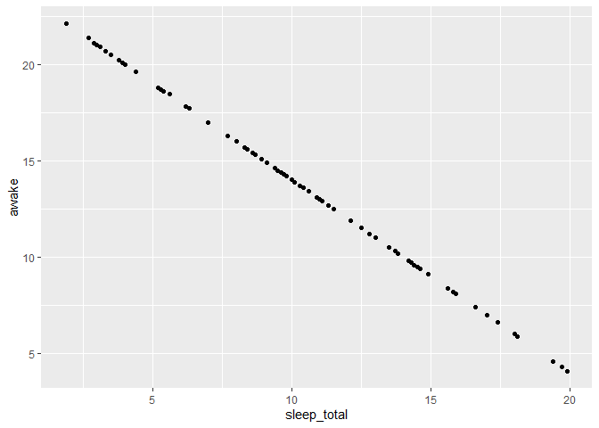
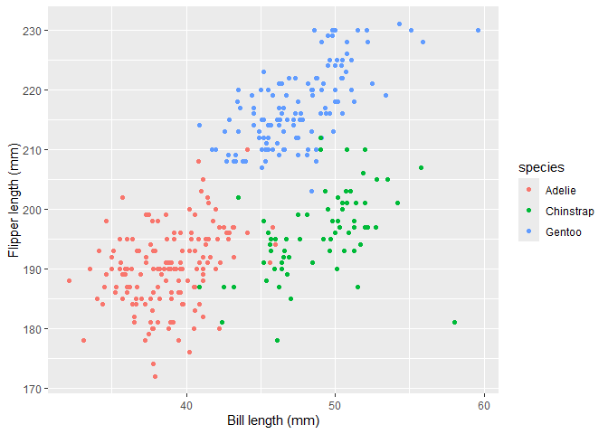
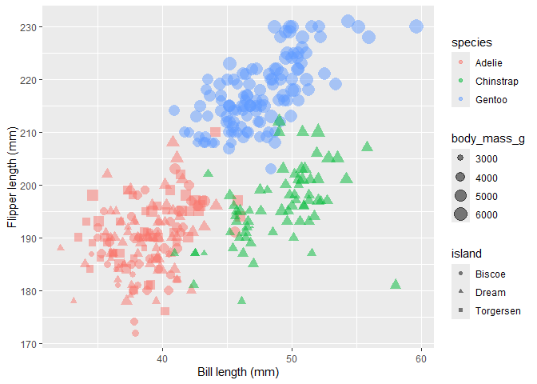
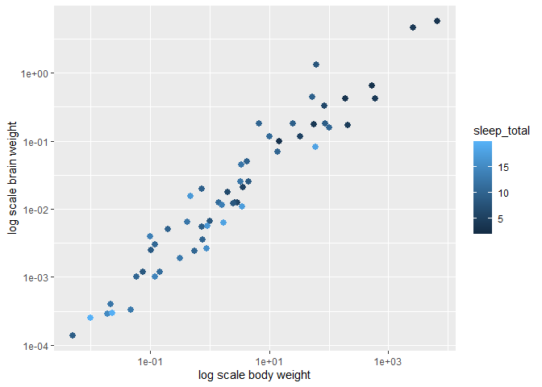
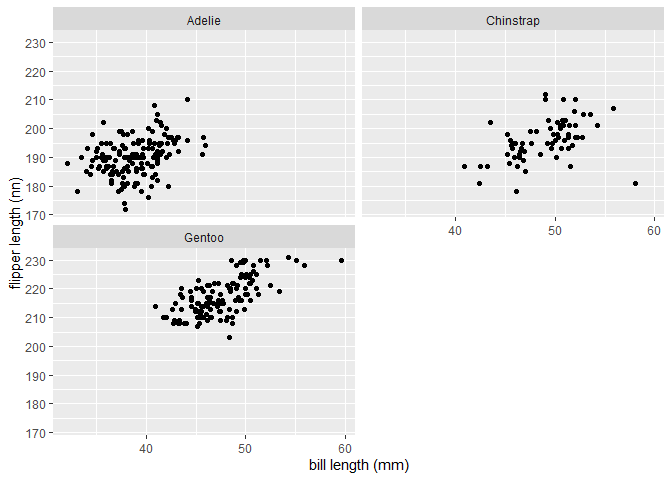
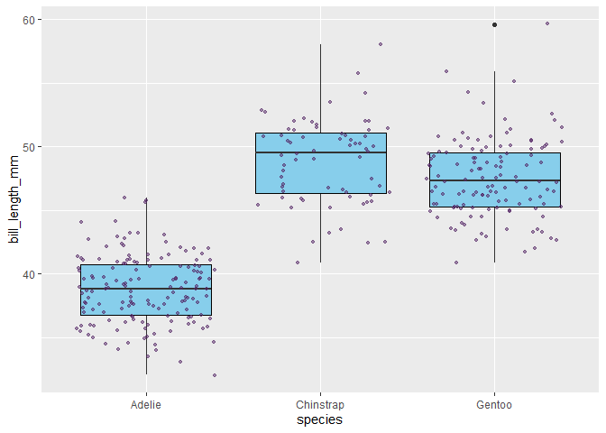
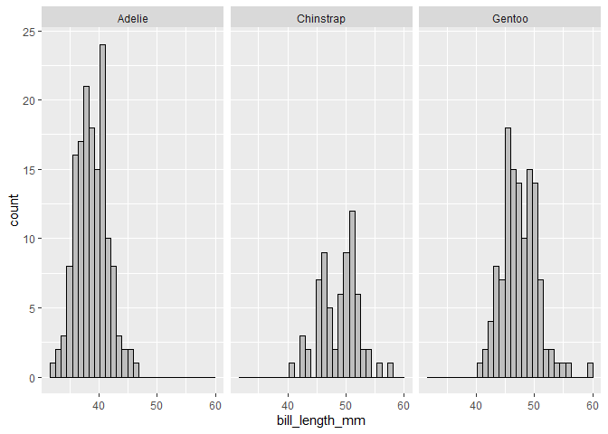
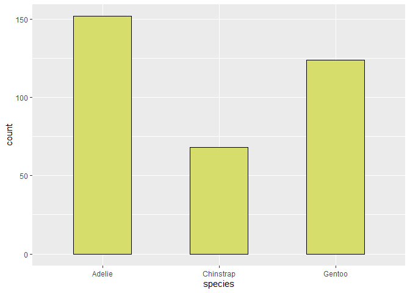

R Notebook
================

### Exercise 2.1

Use R to compute the product of the first 10 integers:  
1 \* 2 \* 3 \* 4 \* 5 \* 6 \* 7 \* 8 \* 9 \* 10

``` r
print(1 * 2 * 3 * 4 * 5 * 6 * 7 * 8 * 9 * 10 )
```

    ## [1] 3628800

### Exercise 2.2 Do the following using R:

1.  Compute the sum 924+124 and assign the result to a variable named a.
2.  Compute a\*a

``` r
a <- 924+124
a * a
```

    ## [1] 1098304

### Exercise 2.3 Answer the following questions:

What happens if you use an invalid character in a variable name? Try
e.g., the following:

``` r
# net income <- income - taxes
# net-income <- income - taxes
# ca$h <- income - taxes
```

What happens if you put R code as a comment? For example,

``` r
income <- 100
taxes <- 20
net_income <- income - taxes
# gross_income <- net_income + taxes
```

What happens if you remove a line break and replace it by a semicolon ;?
For example,

``` r
income <- 200; taxes <- 30
```

What happens if you do two assignments on the same line? For example,

``` r
income2 <- taxes2 <- 100
```

### Exercise 2.4 Do the following:

Create two vectors, height and weight, containing the heights and
weights of five fictional people (i.e., just make up some numbers!).

Combine your two vectors into a data frame.

``` r
height <- c(1.8, 1.7, 1.75, 1.77, 1.78) # meter (m)
weight <- c(80, 70, 67, 65, 66) # Kg
```

### Exercise 2.5

Try creating a vector using x \<- 1:5. What happens? What happens if you
use 5:1 instead? How can you use this notation to create the vector  
(1,2,3,4,5,4,3,2,10)?

``` r
x <- 1:5
print(x)
```

    ## [1] 1 2 3 4 5

``` r
x <- 5:1 
print(x)
```

    ## [1] 5 4 3 2 1

``` r
print(1:10)
```

    ##  [1]  1  2  3  4  5  6  7  8  9 10

### Exercise 2.6

Using the data you created in Exercise 2.4, do the following:

Compute the mean height of the people.

``` r
mean(height)
```

    ## [1] 1.76

Compute the correlation between height and weight.

``` r
cor(height, weight)
```

    ## [1] 0.3224949

### Exercise 2.7 Do the following:

Read the documentation for the function `length.` What does it do? Apply
it to your `height` vector.

``` r
?length
length(height)
```

    ## [1] 5

Read the documentation for the function `sort`. What does it do? What
does the argument `decreasing` (the values of which can be either
`FALSE` or `TRUE`) do? Apply the function to your weight vector.

``` r
?sort
sort(weight, decreasing = TRUE)
```

    ## [1] 80 70 67 66 65

### Exercise 2.8 Compute the following:

1.  sqrt(pi)
2.  e^2 \* (log(4))

``` r
print(sqrt(pi))
```

    ## [1] 1.772454

``` r
print((exp(2))*(log(4)))
```

    ## [1] 10.24341

### Exercise 2.9

R will return non-numerical answers if you try to perform computations
where the answer is infinite or undefined. Try the following to see some
possible results:

Compute 1/0 Compute 0/0 Compute √−1

``` r
print(1/0)
```

    ## [1] Inf

``` r
print(0/0)
```

    ## [1] NaN

``` r
print(sqrt(-1))
```

    ## Warning in sqrt(-1): NaNs produced

    ## [1] NaN

### Exercise 2.10

Install the palmerpenguins package from CRAN. We’ll use it for many of
the exercises and examples that follow.

``` r
install.packages("palmerpenguins")
```

    ## Installing package into 'C:/Users/Ansh/AppData/Local/R/win-library/4.5'
    ## (as 'lib' is unspecified)

    ## package 'palmerpenguins' successfully unpacked and MD5 sums checked
    ## 
    ## The downloaded binary packages are in
    ##  C:\Users\Ansh\AppData\Local\Temp\RtmpGEITM2\downloaded_packages

``` r
library(ggplot2)
```

    ## Warning: package 'ggplot2' was built under R version 4.5.2

### Exercise 2.11

Load the palmerpenguins package that you installed in Exercise 2.10,
using `library(palmerpenguins)`. In this exercise, we’ll study the
penguins dataset contained in said package. View the documentation for
the penguins data and read about its variables. Check the data
structures: how many observations and variables and what type of
variables (numeric, categorical, etc.) are there?

``` r
library(palmerpenguins)
```

    ## Warning: package 'palmerpenguins' was built under R version 4.5.2

    ## 
    ## Attaching package: 'palmerpenguins'

    ## The following objects are masked from 'package:datasets':
    ## 
    ##     penguins, penguins_raw

``` r
View(penguins)
?penguins
str(penguins)
```

    ## tibble [344 × 8] (S3: tbl_df/tbl/data.frame)
    ##  $ species          : Factor w/ 3 levels "Adelie","Chinstrap",..: 1 1 1 1 1 1 1 1 1 1 ...
    ##  $ island           : Factor w/ 3 levels "Biscoe","Dream",..: 3 3 3 3 3 3 3 3 3 3 ...
    ##  $ bill_length_mm   : num [1:344] 39.1 39.5 40.3 NA 36.7 39.3 38.9 39.2 34.1 42 ...
    ##  $ bill_depth_mm    : num [1:344] 18.7 17.4 18 NA 19.3 20.6 17.8 19.6 18.1 20.2 ...
    ##  $ flipper_length_mm: int [1:344] 181 186 195 NA 193 190 181 195 193 190 ...
    ##  $ body_mass_g      : int [1:344] 3750 3800 3250 NA 3450 3650 3625 4675 3475 4250 ...
    ##  $ sex              : Factor w/ 2 levels "female","male": 2 1 1 NA 1 2 1 2 NA NA ...
    ##  $ year             : int [1:344] 2007 2007 2007 2007 2007 2007 2007 2007 2007 2007 ...

Compute summary statistics (means, median, min, max, counts for
categorical variables). Are there any missing values?

``` r
summary(penguins)
```

    ##       species          island    bill_length_mm  bill_depth_mm  
    ##  Adelie   :152   Biscoe   :168   Min.   :32.10   Min.   :13.10  
    ##  Chinstrap: 68   Dream    :124   1st Qu.:39.23   1st Qu.:15.60  
    ##  Gentoo   :124   Torgersen: 52   Median :44.45   Median :17.30  
    ##                                  Mean   :43.92   Mean   :17.15  
    ##                                  3rd Qu.:48.50   3rd Qu.:18.70  
    ##                                  Max.   :59.60   Max.   :21.50  
    ##                                  NA's   :2       NA's   :2      
    ##  flipper_length_mm  body_mass_g       sex           year     
    ##  Min.   :172.0     Min.   :2700   female:165   Min.   :2007  
    ##  1st Qu.:190.0     1st Qu.:3550   male  :168   1st Qu.:2007  
    ##  Median :197.0     Median :4050   NA's  : 11   Median :2008  
    ##  Mean   :200.9     Mean   :4202                Mean   :2008  
    ##  3rd Qu.:213.0     3rd Qu.:4750                3rd Qu.:2009  
    ##  Max.   :231.0     Max.   :6300                Max.   :2009  
    ##  NA's   :2         NA's   :2

### Exercise 2.12

Create a `scatterplot` with total sleep time along the x-axis and time
awake along the y-axis (using the `msleep` data). What pattern do you
see? Can you explain it?

``` r
library(ggplot2)
ggplot(msleep, aes(sleep_total, awake)) +
  geom_point()
```

<!-- -->

### Exercise 2.13

Using the penguins data, do the following:

Create a scatterplot with bill length along the x-axis and flipper
length along the y-axis. Change the x-axis label to read “Bill length
(mm)” and the y-axis label to “Flipper length (mm)”. Use species to set
the colour of the points.

Try adding the argument alpha = 1 to geom_point, i.e., geom_point(alpha
= 1). Does anything happen? Try changing the 1 to 0.75 and 0.25 and see
how that affects the plot.

``` r
ggplot(penguins, aes(bill_length_mm, flipper_length_mm, colour = species)) +
  geom_point(alpha = 1) + 
  labs(x="Bill length (mm)", y="Flipper length (mm)")
```

    ## Warning: Removed 2 rows containing missing values or values outside the scale range
    ## (`geom_point()`).

<!-- -->

### Exercise 2.14

Similar to how you changed the colour of the points, you can also change
their size and shape. The arguments for this are called size and shape.

Change the scatterplot from Exercise 2.13 so that animals from different
islands are represented by different shapes.

Then change it so that the size of each point is determined by the body
mass, i.e., the variable body_mass_g.

``` r
ggplot(penguins, aes(bill_length_mm, flipper_length_mm, colour = species, shape = island, size = body_mass_g)) +
  geom_point(alpha = 0.5) + 
  labs(x="Bill length (mm)", y="Flipper length (mm)")
```

    ## Warning: Removed 2 rows containing missing values or values outside the scale range
    ## (`geom_point()`).

<!-- -->

### Exercise 2.15

Using the msleep data, create a plot of log-transformed body weight
versus log-transformed brain weight. Use total sleep time to set the
colours of the points. Change the text on the axes to something
informative.

``` r
ggplot(msleep, aes(bodywt, brainwt, colour = sleep_total)) + 
      geom_point(size=2.4) +
      labs( x= "log scale body weight",y = "log scale brain weight") +
      scale_x_log10() +
      scale_y_log10()
```

    ## Warning: Removed 27 rows containing missing values or values outside the scale range
    ## (`geom_point()`).

<!-- -->

### Exercise 2.16 Using the penguins data, do the following:

Create a scatterplot with bill_length_mm along the x-axis and
flipper_length_mm along the y-axis, facetted by species.

Read the documentation for facet_wrap (?facet_wrap). How can you change
the number of rows in the plot grid? Create the same plot as in part 1,
but with 2 rows.

``` r
ggplot(penguins, aes(bill_length_mm, flipper_length_mm)) +
  geom_point(size = 1.5) +
  labs(x="bill length (mm)", y="flipper length (nn)") +
  facet_wrap(~species, nrow =2)
```

    ## Warning: Removed 2 rows containing missing values or values outside the scale range
    ## (`geom_point()`).

<!-- -->

### Exercise 2.17

Using the penguins data, do the following: Create boxplots of bill
lengths, grouped by species. Read the documentation for `geom_boxplot.`
How can you change the colours of the boxes and their outlines? Add
`geom_jitter(size = 0.5, alpha = 0.25)`to the plot. What happens?

``` r
ggplot(penguins, aes(species, bill_length_mm)) +
  geom_boxplot(box.colour = "black", fill = "skyblue" ) +
  geom_jitter(size = 1, alpha = 0.5, colour = "#522363") 
```

    ## Warning: Removed 2 rows containing non-finite outside the scale range
    ## (`stat_boxplot()`).

    ## Warning: Removed 2 rows containing missing values or values outside the scale range
    ## (`geom_point()`).

<!-- -->

### Exercise 2.18

Using the penguins data, do the following:

Create a histogram of bill lengths.

Create histograms of bill lengths for different species, using
facetting.

Add a suitable argument to geom_histogram to add black outlines around
the bars12.

``` r
ggplot(penguins, aes(bill_length_mm)) + 
  geom_histogram(colour="black", fill = "grey") +
  facet_wrap(~species)
```

    ## `stat_bin()` using `bins = 30`. Pick better value `binwidth`.

    ## Warning: Removed 2 rows containing non-finite outside the scale range
    ## (`stat_bin()`).

<!-- -->

### Exercise 2.19

Using the penguins data, do the following:

Create a bar chart of species.

Add different colours to the bars by adding a fill argument to geom_bar.

Check the documentation for geom_bar. How can you decrease the width of
the bars?

Return to the code you used for part 1. Add fill = sex to the aes. What
happens?

Next, add position = “dodge” to geom_bar. What happens?

Add coord_flip() to the plot. What happens?

``` r
ggplot(penguins, aes(species)) + 
  geom_bar(fill = "#d6dd6b", colour = "black", width = 0.5)
```

<!-- -->

``` r
ggplot(penguins, aes(species, fill = sex)) + 
  geom_bar(colour = "black", position = "dodge", width = 0.5) +
  coord_flip()
```

<!-- -->

### Exercise 2.20

Do the following:

Create a plot object and save it as a 4-by-4 inch png file.

When preparing images for print, you may want to increase their
resolution. Check the documentation for ggsave. How can you increase the
resolution of your png file to 600 dpi?

``` r
p <- ggplot(penguins, aes(species, fill = sex)) + 
  geom_bar(colour = "black", position = "dodge", width = 0.5) +
  coord_flip()
ggsave("exercise2-20.png", p, height = 4, width = 4, dpi=600)
```

### 0Exercise 2.21

The following tasks are all related to data types and data structures:

Create a text variable using, e.g., a \<- “A rainy day in Edinburgh”.
Check that it gets the correct type. What happens if you use single
quotes marks instead of double quotes when you create the variable?

What data types are the sums 1 + 2, 1L + 2 and 1L + 2L?

What happens if you add a numeric to a character, e.g., “Hello” + 1?

What happens if you perform mathematical operations involving a numeric
and a logical, e.g., FALSE \* 2 or TRUE + 1?

``` r
 a <- "A rainy day in Edinburgh"
class(a)
```

    ## [1] "character"

``` r
 a <- 'A rainy day in Edinburgh'
class(a)
```

    ## [1] "character"

``` r
class(1 + 2)
```

    ## [1] "numeric"

``` r
class(1L + 2)
```

    ## [1] "numeric"

``` r
class(1L + 2L)
```

    ## [1] "integer"

``` r
# class("Hello" + 1) # -> error
class(FALSE * 2)
```

    ## [1] "numeric"

``` r
class(TRUE + 1)
```

    ## [1] "numeric"

### Exercise 2.22

What do the functions ncol, nrow, dim, names, and row.names return when
applied to a data frame

``` r
age <- c(28, 48, 47, 71, 22, 80, 48, 30, 31)
purchase <- c(20, 59, 2, 12, 22, 160, 34, 34, 29)
bookstore <- data.frame(age, purchase)
ncol(bookstore)
```

    ## [1] 2

``` r
nrow(bookstore)
```

    ## [1] 9

``` r
dim(bookstore)
```

    ## [1] 9 2

``` r
names(bookstore)
```

    ## [1] "age"      "purchase"

``` r
row.names(bookstore)
```

    ## [1] "1" "2" "3" "4" "5" "6" "7" "8" "9"

### Exercise 2.23

`matrix` tables can be created from vectors using the function of the
same name. Using the vector`x <- 1:6` use `matrix` to create the
following matrices: $$
 \begin{pmatrix}
  1 & 2 & 3\\
  4 & 5 & 6
\end{pmatrix}
 $$ and

$$
\begin{pmatrix}
  1 & 4\\
  2 & 5\\
  3 & 6
\end{pmatrix}.
$$

Remember to check ?matrix to find out how to set the dimensions of the
matrix, and how it is filled with the numbers from the vector!

``` r
x <- 1:6
matrix(x, nrow = 2, ncol=3, byrow = TRUE)
```

    ##      [,1] [,2] [,3]
    ## [1,]    1    2    3
    ## [2,]    4    5    6

``` r
matrix(x, nrow = 3, ncol=2)
```

    ##      [,1] [,2]
    ## [1,]    1    4
    ## [2,]    2    5
    ## [3,]    3    6

### Exercise 2.24

The following tasks all involve using the \[i, j\] notation for
extracting data from data frames:

Why does airquality\[, 3\] not return the third row of airquality?

    this actually prints the 3rd column

Extract the first five rows from airquality. Hint: a fast way of
creating the vector c(1, 2, 3, 4, 5) is to write 1:5.

Compute the correlation between the Temp and Wind vectors of airquality
without referring to them using \$.

Extract all columns from airquality except Temp and Wind.

``` r
airquality[1:5, ]
```

    ##   Ozone Solar.R Wind Temp Month Day
    ## 1    41     190  7.4   67     5   1
    ## 2    36     118  8.0   72     5   2
    ## 3    12     149 12.6   74     5   3
    ## 4    18     313 11.5   62     5   4
    ## 5    NA      NA 14.3   56     5   5

``` r
cor(airquality[, c(3,4)])
```

    ##            Wind       Temp
    ## Wind  1.0000000 -0.4579879
    ## Temp -0.4579879  1.0000000

``` r
airquality[, c(-3, -4)]
```

    ##     Ozone Solar.R Month Day
    ## 1      41     190     5   1
    ## 2      36     118     5   2
    ## 3      12     149     5   3
    ## 4      18     313     5   4
    ## 5      NA      NA     5   5
    ## 6      28      NA     5   6
    ## 7      23     299     5   7
    ## 8      19      99     5   8
    ## 9       8      19     5   9
    ## 10     NA     194     5  10
    ## 11      7      NA     5  11
    ## 12     16     256     5  12
    ## 13     11     290     5  13
    ## 14     14     274     5  14
    ## 15     18      65     5  15
    ## 16     14     334     5  16
    ## 17     34     307     5  17
    ## 18      6      78     5  18
    ## 19     30     322     5  19
    ## 20     11      44     5  20
    ## 21      1       8     5  21
    ## 22     11     320     5  22
    ## 23      4      25     5  23
    ## 24     32      92     5  24
    ## 25     NA      66     5  25
    ## 26     NA     266     5  26
    ## 27     NA      NA     5  27
    ## 28     23      13     5  28
    ## 29     45     252     5  29
    ## 30    115     223     5  30
    ## 31     37     279     5  31
    ## 32     NA     286     6   1
    ## 33     NA     287     6   2
    ## 34     NA     242     6   3
    ## 35     NA     186     6   4
    ## 36     NA     220     6   5
    ## 37     NA     264     6   6
    ## 38     29     127     6   7
    ## 39     NA     273     6   8
    ## 40     71     291     6   9
    ## 41     39     323     6  10
    ## 42     NA     259     6  11
    ## 43     NA     250     6  12
    ## 44     23     148     6  13
    ## 45     NA     332     6  14
    ## 46     NA     322     6  15
    ## 47     21     191     6  16
    ## 48     37     284     6  17
    ## 49     20      37     6  18
    ## 50     12     120     6  19
    ## 51     13     137     6  20
    ## 52     NA     150     6  21
    ## 53     NA      59     6  22
    ## 54     NA      91     6  23
    ## 55     NA     250     6  24
    ## 56     NA     135     6  25
    ## 57     NA     127     6  26
    ## 58     NA      47     6  27
    ## 59     NA      98     6  28
    ## 60     NA      31     6  29
    ## 61     NA     138     6  30
    ## 62    135     269     7   1
    ## 63     49     248     7   2
    ## 64     32     236     7   3
    ## 65     NA     101     7   4
    ## 66     64     175     7   5
    ## 67     40     314     7   6
    ## 68     77     276     7   7
    ## 69     97     267     7   8
    ## 70     97     272     7   9
    ## 71     85     175     7  10
    ## 72     NA     139     7  11
    ## 73     10     264     7  12
    ## 74     27     175     7  13
    ## 75     NA     291     7  14
    ## 76      7      48     7  15
    ## 77     48     260     7  16
    ## 78     35     274     7  17
    ## 79     61     285     7  18
    ## 80     79     187     7  19
    ## 81     63     220     7  20
    ## 82     16       7     7  21
    ## 83     NA     258     7  22
    ## 84     NA     295     7  23
    ## 85     80     294     7  24
    ## 86    108     223     7  25
    ## 87     20      81     7  26
    ## 88     52      82     7  27
    ## 89     82     213     7  28
    ## 90     50     275     7  29
    ## 91     64     253     7  30
    ## 92     59     254     7  31
    ## 93     39      83     8   1
    ## 94      9      24     8   2
    ## 95     16      77     8   3
    ## 96     78      NA     8   4
    ## 97     35      NA     8   5
    ## 98     66      NA     8   6
    ## 99    122     255     8   7
    ## 100    89     229     8   8
    ## 101   110     207     8   9
    ## 102    NA     222     8  10
    ## 103    NA     137     8  11
    ## 104    44     192     8  12
    ## 105    28     273     8  13
    ## 106    65     157     8  14
    ## 107    NA      64     8  15
    ## 108    22      71     8  16
    ## 109    59      51     8  17
    ## 110    23     115     8  18
    ## 111    31     244     8  19
    ## 112    44     190     8  20
    ## 113    21     259     8  21
    ## 114     9      36     8  22
    ## 115    NA     255     8  23
    ## 116    45     212     8  24
    ## 117   168     238     8  25
    ## 118    73     215     8  26
    ## 119    NA     153     8  27
    ## 120    76     203     8  28
    ## 121   118     225     8  29
    ## 122    84     237     8  30
    ## 123    85     188     8  31
    ## 124    96     167     9   1
    ## 125    78     197     9   2
    ## 126    73     183     9   3
    ## 127    91     189     9   4
    ## 128    47      95     9   5
    ## 129    32      92     9   6
    ## 130    20     252     9   7
    ## 131    23     220     9   8
    ## 132    21     230     9   9
    ## 133    24     259     9  10
    ## 134    44     236     9  11
    ## 135    21     259     9  12
    ## 136    28     238     9  13
    ## 137     9      24     9  14
    ## 138    13     112     9  15
    ## 139    46     237     9  16
    ## 140    18     224     9  17
    ## 141    13      27     9  18
    ## 142    24     238     9  19
    ## 143    16     201     9  20
    ## 144    13     238     9  21
    ## 145    23      14     9  22
    ## 146    36     139     9  23
    ## 147     7      49     9  24
    ## 148    14      20     9  25
    ## 149    30     193     9  26
    ## 150    NA     145     9  27
    ## 151    14     191     9  28
    ## 152    18     131     9  29
    ## 153    20     223     9  30
